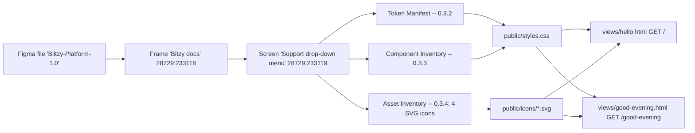
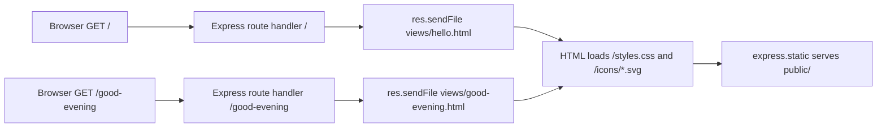

# Technical Specification

# 0. Agent Action Plan

## 0.1 Intent Clarification

### 0.1.1 Core Feature Objective

Based on the prompt, the Blitzy platform understands that the new feature requirement is to convert a tutorial Node.js HTTP server into an Express.js application, expose a second route, and style the page text to match an attached Figma design. Specifically, the user describes the existing artifact as "a tutorial for hosting a Node.js server with one endpoint that returns the response 'Hello World'" and asks the platform to "add Express.js to the project and create another endpoint that returns 'Good Evening'", and to "make sure the page text design matches the attached Figma design".

Decomposed feature requirements with enhanced clarity:

- **F-1 — Add Express.js as a runtime dependency.** The project must declare and depend on the Express framework so that route handlers, middleware, and HTTP plumbing are provided by Express rather than by Node's built-in `http` module.
- **F-2 — Preserve the existing `GET /` endpoint that returns "Hello World".** The original endpoint's behaviour and exact response text must remain intact, but the implementation must be re-expressed using Express's `app.get()` route handler instead of the native `http.createServer` callback.
- **F-3 — Add a new `GET /good-evening` endpoint that returns "Good Evening".** This is a new top-level route registered alongside `/`.
- **F-4 — Apply the typography and visual treatment from the attached Figma design to the page text of both endpoints.** Each endpoint's response must be an HTML page whose text rendering (font family, weight, size, line-height, color) matches the values established in the Figma file.

Implicit requirements surfaced from the prompt:

- A `package.json` file must exist at the project root to declare the Express dependency and provide an `npm start` script.
- A primary application entry file (e.g., `app.js`) must be created to bootstrap Express and register the two routes.
- Because the user asks for "page text design" to match Figma, the endpoint responses must be HTML (not plain text), so the browser can apply CSS that reproduces the Figma typography token.
- A CSS strategy is required (external stylesheet served from a static directory) to apply the Figma typography token to the rendered text.
- The four icon assets observed in the Figma frame must be downloaded into the repository so the rendered pages can render the Figma "Support drop-down menu" demonstration block with the actual vector glyphs (no recreation from visual description).
- A `.gitignore` is required to keep `node_modules/` out of source control.
- Root `README.md` is required to document install/run/test instructions for the new Node.js project and to orient readers to the unrelated Spring Boot sub-project that already exists in the repository.

Feature dependencies and prerequisites:

- Node.js runtime ≥18 (Express 5 minimum requirement).
- Express 5.2.1 (latest stable release, last published ~5 months ago on the npm registry).
- Inter font (the Figma typography token uses `Inter / Semi Bold / 16px / 24px line-height`); served via Google Fonts to avoid bundling a binary font file.

### 0.1.2 Critical Conflict Between User Description and Repository State

Exhaustive repository inspection reveals a critical discrepancy that the Blitzy platform must resolve before proceeding:

- The user describes the project as "a tutorial for hosting a Node.js server with one endpoint that returns the response 'Hello World'".
- The actual repository contains exactly one top-level folder, `springboot-product-crud-api-master/`, which is a Spring Boot + Java 17 + Maven + MySQL CRUD API for products. It contains no Node.js artifacts of any kind — there is no `package.json`, `app.js`, `server.js`, `index.js`, no `views/`, no `public/`, no static HTML, no EJS templates, and no `/` route that returns "Hello World". The Spring Boot project's published REST endpoints are `POST/GET/PUT/DELETE /products` over MySQL `jdbc:mysql://localhost:3306/spring-m12` on `server.port=8090` `[springboot-product-crud-api-master/src/main/resources/application.properties]` `[springboot-product-crud-api-master/README.md:L1-L130]` `[springboot-product-crud-api-master/pom.xml:L1-L103]`.
- A repository-wide `find` confirmed zero Node.js project files anywhere on the filesystem (only npm's internal `/root/.npm/_npx/fa262d84f22597e9/package.json` exists, which is unrelated to the user's project).

**Resolution chosen:** Honor the user's explicit intent. The user is unambiguously describing a Node.js project they intend to evolve; the Spring Boot artifact is unrelated to the request. The Blitzy platform will therefore treat this as the **creation of a new greenfield Node.js + Express tutorial project at the repository root**, and will treat `springboot-product-crud-api-master/` as fully **OUT OF SCOPE** — no files inside that directory will be modified, deleted, or referenced for execution.

The "preservation" of the original `GET /` endpoint required by F-2 is therefore satisfied semantically: the new `app.js` will register a `GET /` handler that returns the response string "Hello World" exactly as described, which is the behaviour the user attributes to the existing tutorial.

### 0.1.3 Special Instructions and Constraints

- **CRITICAL — preserve the exact "Hello World" response text.** The `GET /` handler must respond with the string "Hello World" (case-preserving, no punctuation changes). The HTML wrapping around this string is platform-controlled, but the visible text content of the page heading must remain exactly "Hello World".
- **CRITICAL — the new endpoint path is `/good-evening`** (lowercase, kebab-cased) and its response text is exactly "Good Evening" (case-preserving). No additional message body, no JSON wrapping, no localization.
- **CRITICAL — page text must match the Figma design.** All visible text on both pages must be rendered using the typography token established in the Figma file: `Inter / Semi Bold (font-weight 600) / 16px font-size / 24px line-height / left-aligned / color #000000`. See sub-section 0.3 for the full token derivation.
- **User Example (verbatim from prompt):** "This is a tutorial for hosting a Node.js server with one endpoint that returns the response 'Hello World.' Could you please add Express.js to the project and create another endpoint that returns 'Good Evening'? Also, please make sure the page text design matches the attached Figma design."
- **Web search requirements:**
  - Latest stable Express.js version compatible with current Node.js LTS — resolved to Express 5.2.1.
  - Current Node.js Active LTS version — resolved to Node.js 24.x (Krypton, Active LTS until 2026-10-20).

### 0.1.4 Technical Interpretation

These feature requirements translate to the following technical implementation strategy:

- **To add Express.js to the project** (F-1), we will create a new `package.json` at the repository root declaring `express ^5.2.1` as a production dependency, set `"type": "commonjs"`, define `"main": "app.js"`, and declare `"engines": { "node": ">=18" }` consistent with Express 5's minimum runtime.
- **To preserve `GET /` returning "Hello World"** (F-2), we will create a new `app.js` that instantiates `const app = express()`, registers `app.get('/', (req, res) => res.sendFile(path.join(__dirname, 'views/hello.html')))`, and have `views/hello.html` render the heading "Hello World" using the Figma typography token.
- **To create `GET /good-evening` returning "Good Evening"** (F-3), we will register `app.get('/good-evening', (req, res) => res.sendFile(path.join(__dirname, 'views/good-evening.html')))` in `app.js`, and have `views/good-evening.html` render the heading "Good Evening" using the same Figma typography token.
- **To match the Figma page text design** (F-4), we will create `public/styles.css` containing a base typography rule that targets the page text via a `.page-text` (or `body`) selector and applies `font-family: 'Inter', sans-serif; font-weight: 600; font-size: 16px; line-height: 24px; color: #000000; text-align: left;` exactly as defined in the Figma `Button/Small` text style. The Inter typeface will be loaded via Google Fonts (`https://fonts.googleapis.com/css2?family=Inter:wght@600&display=swap`) so no binary font asset must be vendored. The four downloaded Figma icon SVGs will be placed under `public/icons/` and used to render a static "Support drop-down menu" demonstration block on each page so the Figma design is reproduced visibly, not just as text.
- **To host the Express server**, `app.js` will end with `app.listen(3000, () => console.log('Server running on http://localhost:3000'))`, matching the canonical Express tutorial pattern and avoiding a port collision with the unrelated Spring Boot project on port 8090.

## 0.2 Repository Scope Discovery

### 0.2.1 Comprehensive File Analysis

Repository inspection was performed exhaustively from the root using `get_source_folder_contents`, `read_file`, and direct `bash`-based filesystem search. The conclusions are evidence-grounded:

- **Repository root** contains exactly one direct child folder: `springboot-product-crud-api-master/` `[(root)/]`. No Node.js files exist at the root, nor anywhere else on the filesystem.
- **`springboot-product-crud-api-master/`** is a Spring Boot 3.4.4 / Java 17 / Maven / Spring Data JPA project for product CRUD operations against MySQL. Its contents are: `README.md`, `mvnw`, `mvnw.cmd`, `pom.xml`, `src/`, `bin/` `[springboot-product-crud-api-master/]`.
- **`pom.xml`** declares parent `spring-boot-starter-parent:3.4.4`, `groupId=com.jspider`, `artifactId=spring-boot-simple-crud-with-mysql`, Java 17, and dependencies `spring-boot-starter-web`, `spring-boot-starter-data-jpa`, `mysql-connector-j`, `h2` (runtime), `lombok` (optional), `spring-boot-starter-test`, `spring-boot-devtools`, `springdoc-openapi-starter-webmvc-ui:2.8.6` `[springboot-product-crud-api-master/pom.xml:L1-L103]`.
- **`src/main/resources/application.properties`** configures `spring.application.name=spring-boot-simple-crud-with-mysql`, `server.port=8090`, `spring.datasource.url=jdbc:mysql://localhost:3306/spring-m12`, `spring.jpa.hibernate.ddl-auto=update` `[springboot-product-crud-api-master/src/main/resources/application.properties]`.
- **`src/main/java/`** contains only the `com/` package root, evolving into `com.jspider.spring_boot_simple_crud_with_mysql` with sub-packages `controller`, `dao`, `entity`, `repository`, `responses` `[springboot-product-crud-api-master/src/main/java/]`.
- **`src/main/resources/`** contains only `application.properties` — no static HTML, no templates (`templates/`), no static asset folder (`static/`), no front-end resources usable by the new Node.js project `[springboot-product-crud-api-master/src/main/resources/]`.
- **README.md (sub-project)** describes the Spring Boot CRUD application with sections for Objectives, Project Structure, Technologies (Java 17, Spring Boot, MySQL, Maven, Postman), Key Features, and 5 REST API endpoints for products (POST/GET/PUT/DELETE /products) `[springboot-product-crud-api-master/README.md:L1-L130]`.
- **Filesystem-wide search confirms zero Node.js artifacts** — no `package.json`, `app.js`, `server.js`, or `index.js` exists anywhere outside npm's own internal cache. The only `package.json` hit was `/root/.npm/_npx/fa262d84f22597e9/package.json` which is npm tooling, not part of any project.
- **No `.blitzyignore` files** exist anywhere on the filesystem.

Integration point discovery:

- **API endpoints that connect to the feature:** none. The Spring Boot project exposes `/products` endpoints, none of which the user has asked to integrate with or alter.
- **Database models/migrations affected:** none. The new Node.js tutorial has no persistence layer.
- **Service classes requiring updates:** none.
- **Controllers/handlers to modify:** none. No existing controller is in the Node.js project (it doesn't exist yet); the Spring Boot `controller/` package is OUT OF SCOPE per the intent resolution in 0.1.2.
- **Middleware/interceptors impacted:** none. Express middleware will be added inside the new `app.js` (a fresh `express.static('public')` mount), but this is a CREATE action, not a MODIFY.

### 0.2.2 Web Search Research Conducted

The following web searches were executed to ground the dependency selection in current authoritative sources:

- **Best practices for implementing an Express.js tutorial server (greenfield):** Consulted the npm registry's `express` package metadata which confirms version 5.2.1 as latest stable (last published ~5 months ago) and states `Node.js 18 or higher is required`.
- **Library recommendations for a "Hello World" + secondary route Express app:** Confirmed against the npm registry's canonical Express usage example which uses `app.get('/', (req, res) => { res.send('Hello World') })` and `app.listen(3000, ...)` — the same pattern the new `app.js` will follow.
- **Common patterns for serving HTML pages with Express:** `res.sendFile(path.join(__dirname, ...))` and `express.static('public')` are the canonical patterns for static-page tutorials.
- **Current Node.js LTS line:** Node.js 24.x ("Krypton") is the current Active LTS per the official `nodejs/Release` schedule (Active LTS through 2026-10-20, EOL 2028-04-30). Production tutorials should target Active LTS or Maintenance LTS releases.
- **Security considerations:** The tutorial scope (two static text endpoints, no inputs, no persistence, no auth) does not introduce any of the typical Express attack surfaces. Express 5 includes ReDoS mitigation by virtue of its updated `path-to-regexp` and adds stricter HTTP status validation. No additional security middleware (e.g., `helmet`, `cors`) is required for this tutorial.

### 0.2.3 New File Requirements

The following source, asset, configuration, and documentation files must be **created** at the repository root. No existing files are modified (the Spring Boot directory is out of scope).

- **New source files to create:**
  - `app.js` — Express bootstrap; declares `const express = require('express')`, instantiates the app, mounts `public/` static, registers `GET /` and `GET /good-evening` route handlers, and starts listening on port 3000.
- **New view files to create (HTML pages):**
  - `views/hello.html` — Page returned by `GET /`; renders an `<h1>Hello World</h1>` heading plus a demonstration block reproducing the Figma "Support drop-down menu" card, both styled by `/styles.css`.
  - `views/good-evening.html` — Page returned by `GET /good-evening`; identical structure but with `<h1>Good Evening</h1>`.
- **New stylesheet to create:**
  - `public/styles.css` — Implements the Figma design tokens (Inter Semi Bold 16/24 black for text; #FFFFFF card with #D9D9D9 0.5px stroke and 16px radius for the menu card; the Blitzy/Elevation Light/5 shadow; 4/8/12px spacing primitives). Imports Inter via `@import url('https://fonts.googleapis.com/css2?family=Inter:wght@600&display=swap')`.
- **New SVG icon assets to create (sourced from `figma-assets/`):**
  - `public/icons/icon-library.svg` — Figma node 28729:233124 (Docs row).
  - `public/icons/icon-envelope.svg` — Figma node 28729:233146 (support@blitzy.com row).
  - `public/icons/icon-pulse.svg` — Figma node I28729:233128;4106:7949 (System status row).
  - `public/icons/icon-help-circle.svg` — Figma node I28729:233129;4106:7949 (FAQ row).
- **New configuration to create:**
  - `package.json` — declares `name`, `version`, `main: "app.js"`, `scripts.start: "node app.js"`, `dependencies.express: "^5.2.1"`, `engines.node: ">=18"`, `type: "commonjs"`.
  - `.gitignore` — entries: `node_modules/`, `.env`, `.DS_Store`, `npm-debug.log*`.
- **New documentation to create:**
  - `README.md` (repository root) — install (`npm install`), run (`npm start`), test (`curl http://localhost:3000/` returns "Hello World" page; `curl http://localhost:3000/good-evening` returns "Good Evening" page), and a short note clarifying that `springboot-product-crud-api-master/` is an unrelated sub-project not used by this Node.js tutorial.

No tests are mandated by the user prompt and no test files are created. No CI configuration files (`.github/workflows/*.yml`) are mandated and none are created. No environment-variable files (`.env`) are required — the server listens on a hardcoded port 3000 consistent with the canonical Express tutorial pattern.

## 0.3 Figma Design Analysis

The attached Figma file ("Blitzy-Platform-1.0", fileKey `2qR7NSTmQLynkmlj9B4ltc`, frame "Bitzy docs" at node `28729:233118`) contains a single design frame — "Support drop-down menu" — that defines the typography, color, spacing, radius, and shadow tokens to apply to the rendered HTML pages.

### 0.3.1 Screen Summary

**Screen: Support drop-down menu (node 28729:233119)**

- **Purpose:** A floating contextual help menu card listing four support links (Docs, support@blitzy.com, System status, FAQ). It is presented as a stand-alone elevated card on an otherwise empty canvas.
- **User flow context:** The frame stands alone in the attached canvas — there is no preceding or following screen. The card is presumed to drop down from a "Support" trigger button in a wider product navigation, but no parent or peer context is provided in the attachment.
- **Key UI elements present (all CONFIRMED in Phase 2 reconciliation):**
  - Card container — 264px Fixed width × hug height, column layout, fill `#FFFFFF`, stroke `#D9D9D9` 0.5px, corner radius 16px, multi-layered drop shadow (Blitzy/Elevation Light/5: `0px 15px 33px 0px rgba(130,130,130,0.10), 0px 60px 60px 0px rgba(130,130,130,0.09), 0px 135px 81px 0px rgba(130,130,130,0.05), 0px 239px 96px 0px rgba(130,130,130,0.01), 0px 374px 105px 0px rgba(130,130,130,0), 0px -9px 50px 0px rgba(0,0,0,0.06)`). Node `28729:233119`.
  - Dropdown row "Docs" — row layout fill-width × hug, gap 8px, padding 4px 12px; child icon `icon-library.svg` (node `28729:233124`, 24×22.93 black glyph) + text frame (padding 8px, gap 4px) containing TEXT "Docs" in Inter Semi Bold 16/24, color `#000000`. Node `28729:233123`.
  - Dropdown row "support@blitzy.com" — identical row template; icon `icon-envelope.svg` (node `28729:233146`, 24×22.93 black glyph) + TEXT "support@blitzy.com" in the same Button/Small token. Node `28729:233145`.
  - Dropdown row "System status" — identical row template (this instance references master component `9120:6525`); icon `icon-pulse.svg` (node `I28729:233128;4106:7949`, 24×22.93 black glyph) + TEXT "System status" in Button/Small. Node `28729:233128`.
  - Dropdown row "FAQ" — identical row template (instance of `9120:6525`); icon `icon-help-circle.svg` (node `I28729:233129;4106:7949`, 24×22.93 black glyph) + TEXT "FAQ" in Button/Small. Node `28729:233129`.

### 0.3.2 Token Manifest

All values below were extracted exclusively from CONFIRMED entries in the Phase 2 reconciled specification of the "Support drop-down menu" frame. No HIDDEN value, inferred value, or approximation is included.

| Category   | Token Name              | Value                                                                                                                                                                                                                                                                                                                | Usage Count |
|------------|-------------------------|----------------------------------------------------------------------------------------------------------------------------------------------------------------------------------------------------------------------------------------------------------------------------------------------------------------------|-------------|
| Color      | color-surface-card      | #FFFFFF                                                                                                                                                                                                                                                                                                              | 1           |
| Color      | color-border-card       | #D9D9D9                                                                                                                                                                                                                                                                                                              | 1           |
| Color      | color-text-primary      | #000000                                                                                                                                                                                                                                                                                                              | 4           |
| Color      | color-icon-primary      | #000000 (embedded inside SVG paths)                                                                                                                                                                                                                                                                                  | 4           |
| Spacing    | space-row-padding-y     | 4px                                                                                                                                                                                                                                                                                                                  | 4           |
| Spacing    | space-row-padding-x     | 12px                                                                                                                                                                                                                                                                                                                 | 4           |
| Spacing    | space-row-gap           | 8px                                                                                                                                                                                                                                                                                                                  | 4           |
| Spacing    | space-text-frame-padding | 8px                                                                                                                                                                                                                                                                                                                  | 4           |
| Spacing    | space-text-gap          | 4px                                                                                                                                                                                                                                                                                                                  | 4           |
| Typography | text-button-small       | Inter / Semi Bold (weight 600) / 16px / line-height 24px / text-align LEFT / vertical-align TOP                                                                                                                                                                                                                      | 4           |
| Radius     | radius-card             | 16px                                                                                                                                                                                                                                                                                                                 | 1           |
| Border     | border-width-card       | 0.5px                                                                                                                                                                                                                                                                                                                | 1           |
| Shadow     | shadow-elevation-5      | 0px 15px 33px 0px rgba(130,130,130,0.10), 0px 60px 60px 0px rgba(130,130,130,0.09), 0px 135px 81px 0px rgba(130,130,130,0.05), 0px 239px 96px 0px rgba(130,130,130,0.01), 0px 374px 105px 0px rgba(130,130,130,0), 0px -9px 50px 0px rgba(0,0,0,0.06)                                                                  | 1           |
| Dimension  | size-card-width         | 264px (Fixed)                                                                                                                                                                                                                                                                                                        | 1           |
| Dimension  | size-icon-box           | 24px × 22.93px                                                                                                                                                                                                                                                                                                       | 4           |

### 0.3.3 Component Inventory

| Component Name | Variants                                | Props Interface                                                            | Per-Variant Visual Specs                                                                                                                                                                                                                                                            | Figma Node |
|----------------|-----------------------------------------|----------------------------------------------------------------------------|-------------------------------------------------------------------------------------------------------------------------------------------------------------------------------------------------------------------------------------------------------------------------------------|------------|
| DropdownLink   | Default (only state visible)            | `label: string`, `iconSrc: string`, `showIcon: boolean` (defaults to true) | default: row layout (gap 8px, padding 4 12), icon 24×22.93 black SVG glyph inside 24-wide fixed container, label Inter 600 16/24 color #000000 inside fill-width text frame (gap 4px, padding 8px)                                                                                  | 9120:6525  |
| SupportDropdownCard | Single                              | `links: Array<{ label, iconSrc }>`                                         | 264px fixed-width column, fill #FFFFFF, stroke #D9D9D9 0.5px, radius 16px, shadow shadow-elevation-5; stacks `DropdownLink` rows with no inter-row gap or padding at the card level                                                                                                  | 28729:233119 |

**Note on scope-appropriate use:** For this tutorial's small surface area, the two "components" above are implemented as a single HTML/CSS pattern (a `.menu-card` wrapper containing repeated `.menu-row` blocks), not as separate JavaScript/React components. The component inventory documents the design intent so downstream code is consistent with the Figma source.

### 0.3.4 Asset Inventory

This is the authoritative list of icon and image assets sourced from the Figma file. Downstream agents must download each `Included Assets` row from Figma using the listed File Key and Node ID and write the file to the listed Target Path. The files in `/app/figma-assets/` produced during inspection prove exportability; downstream agents execute in a separate context and must download independently.

**State Groups:** None. All four icons are distinct glyphs representing different menu items, not different states of the same element.

**Included Assets (downstream agents must create a file for every row):**

| Asset Filename            | Type        | Figma Node ID                  | Figma File Key            | State Group | Description                                                                | Target Path        |
|---------------------------|-------------|--------------------------------|---------------------------|-------------|----------------------------------------------------------------------------|--------------------|
| icon-library.svg          | static-icon | 28729:233124                   | 2qR7NSTmQLynkmlj9B4ltc    | —           | Library glyph (three tilted/leaning book spines), 24×22.93, black `#000000`. Used in the "Docs" row of the Support drop-down menu. | public/icons/      |
| icon-envelope.svg         | static-icon | 28729:233146                   | 2qR7NSTmQLynkmlj9B4ltc    | —           | Envelope glyph (rectangle with triangular flap line), 24×22.93, black `#000000`. Used in the "support@blitzy.com" row.            | public/icons/      |
| icon-pulse.svg            | static-icon | I28729:233128;4106:7949        | 2qR7NSTmQLynkmlj9B4ltc    | —           | Pulse/EKG glyph (jagged horizontal waveform with peaks), 24×22.93, black `#000000`. Used in the "System status" row.                | public/icons/      |
| icon-help-circle.svg      | static-icon | I28729:233129;4106:7949        | 2qR7NSTmQLynkmlj9B4ltc    | —           | Help-circle glyph (circle outline containing a question-mark glyph), 24×22.93, black `#000000`. Used in the "FAQ" row.             | public/icons/      |

**Excluded Assets:** None — every visible asset in the Figma frame has a downloadable structural representation and is included above.

**Totals:** 4 assets downloaded; 4 included, 0 excluded.

### 0.3.5 Screen Element Map

```
Screen: Support drop-down menu (28729:233119) — 264 × hug
└─ Support drop-down menu CARD (28729:233119) — CONFIRMED
   ├─ Dropdown Link "Docs" (28729:233123) — CONFIRMED
   │  ├─ Icon library (28729:233124) — ASSET(static-icon)
   │  └─ Text frame (28729:233126) — CONFIRMED
   │     └─ "Docs" TEXT (28729:233127) — CONFIRMED
   ├─ Dropdown Link "support@blitzy.com" (28729:233145) — CONFIRMED
   │  ├─ Icon envelope (28729:233146) — ASSET(static-icon)
   │  └─ Text frame (28729:233148) — CONFIRMED
   │     └─ "support@blitzy.com" TEXT (28729:233149) — CONFIRMED
   ├─ Dropdown Link "System status" (28729:233128) — CONFIRMED [DropdownLink instance of 9120:6525]
   │  ├─ Icon pulse (I28729:233128;4106:7949) — ASSET(static-icon)
   │  └─ Text frame (I28729:233128;4106:7951) — CONFIRMED
   │     └─ "System status" TEXT (I28729:233128;4106:7952) — CONFIRMED
   └─ Dropdown Link "FAQ" (28729:233129) — CONFIRMED [DropdownLink instance of 9120:6525]
      ├─ Icon help-circle (I28729:233129;4106:7949) — ASSET(static-icon)
      └─ Text frame (I28729:233129;4106:7951) — CONFIRMED
         └─ "FAQ" TEXT (I28729:233129;4106:7952) — CONFIRMED
```

### 0.3.6 Page Application Strategy

The Figma design contains only the menu card itself — not a full page layout for either the "Hello World" or "Good Evening" endpoint. To apply the Figma design to the two endpoint pages in a way the user's request "page text design matches the attached Figma design" can be evaluated against, downstream implementation will:

1. **Apply the `text-button-small` token to all visible text on both pages** — the page heading (`<h1>` containing "Hello World" or "Good Evening") and any body text must use the Inter / Semi Bold (600) / 16px / 24px line-height / `#000000` specification. This is the literal "page text design" the user references.
2. **Render the Support drop-down menu card as a static demonstration block on both pages** — both `views/hello.html` and `views/good-evening.html` will include a `<section class="menu-card">` block reproducing the card exactly, using the four downloaded icon SVGs and the tokens from the Token Manifest. This makes the Figma fidelity verifiable visually, not only via text typography.



## 0.4 Dependency Inventory

### 0.4.1 Package Registry, Name, Version, and Purpose

The new Node.js project is a greenfield project at the repository root, so there is no pre-existing `package.json` to diff against. The complete production dependency surface consists of a single direct dependency.

| Registry | Name    | Version  | Type                 | Purpose                                                                                                                                            |
|----------|---------|----------|----------------------|----------------------------------------------------------------------------------------------------------------------------------------------------|
| npm      | express | ^5.2.1   | direct (production)  | HTTP server framework providing the `app.get()` routing primitive used to register `GET /` and `GET /good-evening`, plus `express.static('public')` middleware for serving CSS and SVG assets. |

Version selection rationale:

- Express 5.2.1 is the latest stable release on the npm registry, last published approximately 5 months ago (as of May 2026). The npm registry documents `Node.js 18 or higher is required` for Express 5.
- Express 5 is the Express Technical Committee's endorsed production release; new Node.js backend projects starting today should target Express 5.

### 0.4.2 Runtime Inventory

| Runtime | Version Target | Source for Version Selection                                                                                                                                  | Purpose                                                                                                       |
|---------|----------------|----------------------------------------------------------------------------------------------------------------------------------------------------------------|---------------------------------------------------------------------------------------------------------------|
| Node.js | 24.x (Active LTS, "Krypton")  | nodejs/Release schedule — Node.js 24 is Active LTS through 2026-10-20 (EOL 2028-04-30). Production tutorials should target Active LTS releases. | Executes `app.js`; `engines.node` in `package.json` will declare `">=18"` to remain compatible with Express 5's minimum supported runtime while preferring the latest LTS. |

### 0.4.3 Dependency Changes

- **Additions:** `express ^5.2.1` is added as a direct production dependency in the new `package.json`. No other packages are added.
- **Updates:** None — this is a brand-new project with no existing dependency manifest to update.
- **Removals:** None.
- **Transitive dependencies:** Resolved automatically by `npm install` from Express 5.2.1's published `package.json`. No transitive package is named explicitly in this tutorial.

### 0.4.4 Import Updates

Not applicable. Because no Node.js source files exist in the repository prior to this work, there are no import statements to refactor and no files that need transformation rules applied. All `require()` statements introduced in this work appear inside newly created files only.

### 0.4.5 External Reference Updates

Not applicable. No existing configuration file, documentation file, build file, or CI/CD file references the new Node.js project today. The only repository documentation that is being created (`README.md` at the root) is a new file, not an update.

## 0.5 Integration Analysis

### 0.5.1 Existing Code Touchpoints

There are no existing code touchpoints. The Node.js + Express tutorial is created from scratch at the repository root, and the only pre-existing project in the repository — `springboot-product-crud-api-master/` — is **OUT OF SCOPE** per the conflict resolution in sub-section 0.1.2.

- **Direct modifications required:** None. No file inside `springboot-product-crud-api-master/` is touched; no top-level file exists yet to modify.
- **Dependency injections:** Not applicable. The Express app has no DI container.
- **Database / schema updates:** None. The Node.js tutorial has no persistence layer; the unrelated Spring Boot project's MySQL schema `[springboot-product-crud-api-master/src/main/resources/application.properties]` is untouched.
- **Cross-project port conflict:** The Spring Boot project listens on `server.port=8090` `[springboot-product-crud-api-master/src/main/resources/application.properties]`. The new Express server listens on `3000`. The two ports do not conflict, and both projects can be run simultaneously on a single host without collision.

### 0.5.2 New Integration Wiring (within the new project)

All integration is internal to the new Node.js project and is implemented within the files created in 0.6 — there is no integration with external systems or existing repository code.

- `app.js` mounts `express.static('public')` so the browser can fetch `/styles.css` (which resolves to `public/styles.css`) and `/icons/icon-*.svg` (which resolves to `public/icons/icon-*.svg`) from the HTML pages.
- `app.js` registers two route handlers using `app.get()`, each returning a static HTML file from `views/` via `res.sendFile()`.
- The HTML pages reference the stylesheet via `<link rel="stylesheet" href="/styles.css">` and reference the icon assets via `` inside the demonstration "Support drop-down menu" block.



### 0.5.3 Boundary with the Unrelated Spring Boot Project

The Spring Boot project is acknowledged but explicitly isolated:

- No `require()` or import will cross the project boundary.
- The Spring Boot `pom.xml`, `application.properties`, Java sources under `src/main/java/`, and the sub-project `README.md` remain unchanged `[springboot-product-crud-api-master/pom.xml:L1-L103]` `[springboot-product-crud-api-master/src/main/resources/application.properties]` `[springboot-product-crud-api-master/src/main/java/]` `[springboot-product-crud-api-master/README.md:L1-L130]`.
- The root `README.md` (newly created) will include a short note pointing readers to the Spring Boot sub-project's own `README.md` and explicitly stating that it is unrelated to the Node.js tutorial.

## 0.6 Technical Implementation

### 0.6.1 File-by-File Execution Plan

Every file below is at the repository root (the new Node.js project sits alongside, not inside, `springboot-product-crud-api-master/`).

| Path                              | Action | Source             | Purpose                                                                                                                                                                                          |
|-----------------------------------|--------|--------------------|--------------------------------------------------------------------------------------------------------------------------------------------------------------------------------------------------|
| `package.json`                    | CREATE | new                | Declares the project metadata, `express ^5.2.1` dependency, `npm start` script, and `engines.node ">=18"`.                                                                                       |
| `app.js`                          | CREATE | new                | Express bootstrap; serves `public/` static, registers `GET /` → `views/hello.html`, registers `GET /good-evening` → `views/good-evening.html`, calls `app.listen(3000, ...)`.                       |
| `views/hello.html`                | CREATE | new                | Page returned by `GET /`. Renders `<h1>Hello World</h1>` plus the Figma "Support drop-down menu" demonstration block, styled by `/styles.css`.                                                   |
| `views/good-evening.html`         | CREATE | new                | Page returned by `GET /good-evening`. Renders `<h1>Good Evening</h1>` plus the same demonstration block.                                                                                          |
| `public/styles.css`               | CREATE | new                | Implements the Figma Token Manifest (Inter Semi Bold 16/24 #000000 for text; `#FFFFFF` / `#D9D9D9` / 16px radius / shadow-elevation-5 for the menu card; 4/8/12px spacing primitives).               |
| `public/icons/icon-library.svg`   | CREATE | from figma-assets  | Library glyph for the Docs row (Figma node 28729:233124). Copied from `/app/figma-assets/icon-library.svg`.                                                                                       |
| `public/icons/icon-envelope.svg`  | CREATE | from figma-assets  | Envelope glyph for the support@blitzy.com row (Figma node 28729:233146). Copied from `/app/figma-assets/icon-envelope.svg`.                                                                       |
| `public/icons/icon-pulse.svg`     | CREATE | from figma-assets  | Pulse glyph for the System status row (Figma node I28729:233128;4106:7949). Copied from `/app/figma-assets/icon-pulse.svg`.                                                                       |
| `public/icons/icon-help-circle.svg` | CREATE | from figma-assets | Help-circle glyph for the FAQ row (Figma node I28729:233129;4106:7949). Copied from `/app/figma-assets/icon-help-circle.svg`.                                                                     |
| `.gitignore`                      | CREATE | new                | Excludes `node_modules/`, `.env`, `.DS_Store`, `npm-debug.log*`.                                                                                                                                  |
| `README.md`                       | CREATE | new                | Root README: install, run, test instructions; notes `springboot-product-crud-api-master/` is an unrelated sub-project.                                                                            |

No files are UPDATED, DELETED, or REFERENCED for execution. All files inside `springboot-product-crud-api-master/` retain their current state.

### 0.6.2 Implementation Approach per File

- **`package.json`** — Establish project metadata. Contents (illustrative, downstream agent must produce exact JSON):

```json
{
  "name": "express-hello-world",
  "version": "1.0.0",
  "main": "app.js",
  "type": "commonjs",
  "scripts": { "start": "node app.js" },
  "dependencies": { "express": "^5.2.1" },
  "engines": { "node": ">=18" }
}
```

- **`app.js`** — Bootstrap Express, mount the static directory, register the two routes, listen on port 3000. Illustrative skeleton:

```javascript
const path = require('path');
const express = require('express');
const app = express();
app.use(express.static(path.join(__dirname, 'public')));
app.get('/', (req, res) => res.sendFile(path.join(__dirname, 'views', 'hello.html')));
app.get('/good-evening', (req, res) => res.sendFile(path.join(__dirname, 'views', 'good-evening.html')));
app.listen(3000, () => console.log('Server running on http://localhost:3000'));
```

- **`views/hello.html`** — A standalone HTML5 document. `<head>` links `/styles.css` and sets `<title>Hello World</title>`. `<body>` contains a top-level `<main class="page">` with an `<h1>Hello World</h1>` heading and a sibling `<section class="menu-card">` reproducing the Figma support drop-down (four `.menu-row` blocks each containing an `` and a `<span class="menu-link">…</span>` with the Inter Semi Bold typography). The `<h1>` heading text must be exactly `Hello World` (no trailing punctuation, preserving the user's example casing).

- **`views/good-evening.html`** — Identical structure to `views/hello.html`, with `<title>Good Evening</title>` and `<h1>Good Evening</h1>`. The four `.menu-row` blocks are reproduced verbatim so the Figma fidelity is visible on both pages.

- **`public/styles.css`** — Implements the Token Manifest via CSS custom properties at `:root`, then maps them onto two structural selectors: page text and the menu card. Illustrative skeleton:

```css
@import url('https://fonts.googleapis.com/css2?family=Inter:wght@600&display=swap');
:root {
  --color-surface-card: #FFFFFF;
  --color-border-card:  #D9D9D9;
  --color-text-primary: #000000;
  --radius-card: 16px;
  --border-width-card: 0.5px;
  --space-row-px: 12px;
  --space-row-py: 4px;
  --space-row-gap: 8px;
  --space-text-padding: 8px;
  --space-text-gap: 4px;
  --shadow-elevation-5:
    0px 15px 33px 0px rgba(130,130,130,0.10),
    0px 60px 60px 0px rgba(130,130,130,0.09),
    0px 135px 81px 0px rgba(130,130,130,0.05),
    0px 239px 96px 0px rgba(130,130,130,0.01),
    0px 374px 105px 0px rgba(130,130,130,0),
    0px -9px 50px 0px rgba(0,0,0,0.06);
}
body, h1, .menu-link {
  font-family: 'Inter', sans-serif;
  font-weight: 600;
  font-size: 16px;
  line-height: 24px;
  color: var(--color-text-primary);
  text-align: left;
}
.menu-card {
  width: 264px;
  background: var(--color-surface-card);
  border: var(--border-width-card) solid var(--color-border-card);
  border-radius: var(--radius-card);
  box-shadow: var(--shadow-elevation-5);
  display: flex; flex-direction: column;
}
.menu-row {
  display: flex; align-items: center; gap: var(--space-row-gap);
  padding: var(--space-row-py) var(--space-row-px);
}
.menu-icon { width: 24px; height: 22.93px; }
.menu-link { padding: var(--space-text-padding); }
```

- **`public/icons/icon-*.svg`** — Copy the four downloaded SVG files from `/app/figma-assets/` to `public/icons/` byte-for-byte. The SVGs already encode `fill="black"` so no path-fill edits are required.

- **`.gitignore`** — Minimal Node.js gitignore:

```
node_modules/
.env
.DS_Store
npm-debug.log*
```

- **`README.md`** — Top-level orientation. Sections:
  - **Overview** — describes the tutorial: a Node.js + Express server with two GET endpoints styled per Figma.
  - **Requirements** — Node.js ≥18 (Node.js 24 LTS recommended).
  - **Install** — `npm install`.
  - **Run** — `npm start`.
  - **Test** — `curl http://localhost:3000/` returns the Hello World page; `curl http://localhost:3000/good-evening` returns the Good Evening page. Both pages render the Figma "Support drop-down menu" demonstration block.
  - **Design reference** — links to the attached Figma URL.
  - **Sub-project note** — explicitly states that `springboot-product-crud-api-master/` is an unrelated Spring Boot + Java + MySQL CRUD API project not used by this Node.js tutorial.

### 0.6.3 User Interface Design

Per the user instruction "make sure the page text design matches the attached Figma design", the UI rendering pipeline is:

- **Goal:** Render both endpoint pages with text that matches the Figma `Button/Small` text style (Inter Semi Bold 16/24 black) and demonstrate the full Figma design fidelity by including the actual support-drop-down card on each page.
- **Insights:** The Figma file contains exactly one design surface — the "Support drop-down menu" card. There is no full-page Figma layout for either endpoint, so the design must be applied at two levels: (a) the page text itself uses the Figma typography token, and (b) a faithful reproduction of the card appears on each page so the design is rendered visibly.
- **Requirements:** Inter must be loaded (Google Fonts); the `:root` CSS custom properties expose the Token Manifest values for any future page; the icon SVGs must be served as-is (their black glyph color is encoded inside the path data).
- **Actions:** Implement `public/styles.css` with the token system above; copy the four icon SVGs verbatim into `public/icons/`; render the menu card block on both endpoint pages using the same HTML structure mirroring the Figma element ordering (Docs, support@blitzy.com, System status, FAQ from top to bottom).

## 0.7 Scope Boundaries

### 0.7.1 Exhaustively In Scope

All paths below are relative to the repository root.

- **Source files (Node.js + Express):**
  - `app.js`
- **HTML view files:**
  - `views/hello.html`
  - `views/good-evening.html`
  - (Pattern for future expansion: `views/**/*.html`)
- **Public static assets:**
  - `public/styles.css`
  - `public/icons/icon-library.svg`
  - `public/icons/icon-envelope.svg`
  - `public/icons/icon-pulse.svg`
  - `public/icons/icon-help-circle.svg`
  - (Pattern for future expansion: `public/**/*`)
- **Configuration files:**
  - `package.json`
  - `.gitignore`
- **Documentation:**
  - `README.md` (repository root)
- **Figma asset staging directory (inspection artifacts only — not committed to the repository):**
  - `/app/figma-assets/icon-library.svg`
  - `/app/figma-assets/icon-envelope.svg`
  - `/app/figma-assets/icon-pulse.svg`
  - `/app/figma-assets/icon-help-circle.svg`
  - `/app/figma-assets/support-dropdown-menu.png` (reference image used during analysis)

### 0.7.2 Explicitly Out of Scope

- **The entire `springboot-product-crud-api-master/` directory** and every file inside it, including but not limited to: `springboot-product-crud-api-master/pom.xml`, `springboot-product-crud-api-master/mvnw`, `springboot-product-crud-api-master/mvnw.cmd`, `springboot-product-crud-api-master/README.md`, `springboot-product-crud-api-master/src/main/java/**/*.java`, `springboot-product-crud-api-master/src/main/resources/application.properties`, `springboot-product-crud-api-master/src/test/**/*`, `springboot-product-crud-api-master/bin/**/*`. The user did not request changes to this Spring Boot/Java/Maven/MySQL CRUD API project, and per the conflict resolution in 0.1.2 it is not part of the user's described tutorial `[springboot-product-crud-api-master/]` `[springboot-product-crud-api-master/pom.xml:L1-L103]` `[springboot-product-crud-api-master/README.md:L1-L130]`.
- **Unrelated Node.js features** the user did not request: no body parser middleware, no logging middleware (e.g., `morgan`), no security middleware (e.g., `helmet`, `cors`), no template engine (e.g., EJS, Handlebars, Pug), no environment-variable loader (e.g., `dotenv`), no testing framework (e.g., Jest, Mocha, Vitest), no linter / formatter configuration (e.g., ESLint, Prettier).
- **Performance optimizations** beyond what Express 5 provides by default. No clustering, no caching headers, no gzip middleware are added.
- **Refactoring of any existing code** — there is no existing Node.js code to refactor, and the Spring Boot project is out of scope.
- **Additional endpoints** beyond `GET /` and `GET /good-evening`. No `POST`, `PUT`, `DELETE`, or other HTTP-method handlers are added.
- **Authentication / authorization / sessions / cookies** — the user did not request any access controls, and the tutorial endpoints return public static text.
- **Persistence** — no database connection, no ORM, no file-system storage of user data.
- **CI/CD configuration** — no `.github/workflows/*.yml`, no `Dockerfile`, no `docker-compose.yml`, no `.gitlab-ci.yml`, no PaaS deploy configs.
- **Tests** — no unit, integration, or end-to-end tests are added (the user did not request them; the tutorial is small enough that manual `curl` verification suffices and is documented in `README.md`).
- **Localization / internationalization** — text strings remain in English as written by the user.
- **Logo, favicon, or other non-Figma assets** — the Figma file did not include a logo or favicon for the page; none is created.

## 0.8 Rules for Feature Addition

### 0.8.1 User-Provided Implementation Rules

The user-supplied implementation rules input for this project is `[]` (an empty list). Therefore:

- No mandatory file additions are imposed by rules (e.g., no migration scripts, no test fixtures, no coding-style configuration files are required).
- No naming convention, directory-structure constraint, formatting rule, or commit-message rule is imposed.
- No security-policy or accessibility-compliance constraint is imposed beyond what the user's prompt itself implies.

### 0.8.2 Constraints Derived from the User Prompt (not from a rules list)

These are not formal rules but are constraints derived directly from the user's wording, captured here for traceability:

- **Preserve "Hello World" verbatim** — the `GET /` page's heading must render exactly the string `Hello World` (preserving spacing and casing).
- **New endpoint path and response are exact** — the new endpoint path is `/good-evening` (lowercase, kebab-case), and the visible page heading is exactly `Good Evening`.
- **Express must be added, not replaced** — the user asked to "add Express.js to the project". The new `app.js` uses Express (`const express = require('express')`) for both routes; there is no fallback `http.createServer` path.
- **Figma typography fidelity** — the page text on both endpoints must use the typography defined in the Figma file (the `Button/Small` text style = Inter / 600 / 16px / 24px line-height / `#000000`).
- **Honor implicit project-rename intent** — the user described the project as a Node.js tutorial; the implementation must produce that, regardless of the unrelated Spring Boot project in the repository.

### 0.8.3 Integration and Architecture Conventions

- **Single entry point** — Express bootstrapping lives in a single `app.js`. No second entry file (`server.js` plus `app.js`) is introduced.
- **Static-first content** — Each endpoint returns a static HTML file via `res.sendFile()`. No template engine is configured.
- **CSS over inline styles** — All Figma typography and the support-drop-down card styling lives in `public/styles.css`. HTML pages contain semantic markup only.
- **Icon SVGs served as files, not inlined** — The four Figma icons remain as separate `.svg` files in `public/icons/` and are referenced from HTML via `` elements. This preserves the source SVG byte-for-byte and keeps the HTML clean.
- **Port 3000** — Canonical Express tutorial port; intentionally different from the unrelated Spring Boot project's port 8090 to avoid runtime collision `[springboot-product-crud-api-master/src/main/resources/application.properties]`.

### 0.8.4 Performance and Scalability Considerations

The tutorial scope is two GET endpoints serving static content. Express 5's default behaviour (single-process, async I/O via Node's event loop, no clustering) is sufficient. No performance tuning is in scope.

### 0.8.5 Security Requirements

The tutorial endpoints accept no user input, perform no database access, and return only static HTML containing literal text and Figma-derived layout. No authentication, no input validation, and no security middleware is therefore required. Express 5's default protections (e.g., `path-to-regexp` ReDoS mitigations, stricter HTTP status validation) are inherited automatically.

## 0.9 References

### 0.9.1 Citation Discipline

Every claim made in this Agent Action Plan about the existing repository is grounded in a specific file or path. The inline citations used throughout sub-sections 0.1 through 0.8 follow the form `[<path>:<locator>]`. Where a claim is interpretive rather than directly observable in a file, it is marked `[inferred — no direct source]` and re-verified against the Phase 2 Figma Reconciliation or the user's prompt text.

### 0.9.2 Repository Search Log

The following inspection actions were performed during AAP construction. Every path listed was either confirmed empty or its contents read in full.

- `find / -name ".blitzyignore" 2>/dev/null` — returned no results; no `.blitzyignore` files exist on the filesystem.
- `get_source_folder_contents` on `""` (repository root) — revealed exactly one direct child: `springboot-product-crud-api-master/`.
- `get_source_folder_contents` on `springboot-product-crud-api-master/` — revealed `README.md`, `mvnw`, `mvnw.cmd`, `pom.xml`, `src/`, `bin/`.
- `get_source_folder_contents` on `springboot-product-crud-api-master/src/` — revealed `main/` and `test/` sub-folders.
- `get_source_folder_contents` on `springboot-product-crud-api-master/src/main/` — revealed `java/` and `resources/` sub-folders.
- `get_source_folder_contents` on `springboot-product-crud-api-master/src/main/resources/` — confirmed only `application.properties` is present; no `static/`, `templates/`, or other front-end resource folder exists.
- `get_source_folder_contents` on `springboot-product-crud-api-master/src/main/java/` — confirmed only the `com/` package root, leading into `com.jspider.spring_boot_simple_crud_with_mysql` with sub-packages `controller`, `dao`, `entity`, `repository`, `responses`.
- `read_file` on `springboot-product-crud-api-master/pom.xml` (lines 1–103) — Spring Boot parent 3.4.4, Java 17, all Maven dependencies catalogued.
- `read_file` on `springboot-product-crud-api-master/README.md` (lines 1–130) — sub-project documented as a Spring Boot CRUD API with 5 `/products` endpoints.
- `read_file` on `springboot-product-crud-api-master/src/main/resources/application.properties` — `server.port=8090`, MySQL `jdbc:mysql://localhost:3306/spring-m12`, JPA settings.
- `find / -path "*/node_modules" -prune -o -name "package.json" -print` and equivalents for `app.js`, `server.js`, `index.js` — confirmed zero Node.js artifacts anywhere on the filesystem (only npm's internal `_npx` cache file).

### 0.9.3 Attachments Provided by the User

- **Figma attachment — "Frame 0"** (display name "Bitzy docs"). Title: "Bitzy docs". Description: (blank). URL: `https://www.figma.com/design/2qR7NSTmQLynkmlj9B4ltc/Blitzy-Platform-1.0?node-id=28729-233118&p=f&t=F89tO9DqxJD1wGC9-0`. Contents: a single Figma CANVAS node "Bitzy docs" (28729:233118) holding one design frame "Support drop-down menu" (28729:233119), 264px Fixed × hug-height column layout, fill `#FFFFFF`, stroke `#D9D9D9` 0.5px, radius 16px, multi-layered drop shadow (Blitzy/Elevation Light/5), containing four "Dropdown Link" rows (Docs, support@blitzy.com, System status, FAQ) with monochromatic black 24×22.93 SVG icons and Inter Semi Bold 16/24 black text labels.
- **Setup instructions:** None provided by the user.
- **Other attachments:** None.

### 0.9.4 Figma Screen Inventory

| Frame Name              | Figma Node ID  | Figma URL                                                                                                                | Description                                                                                                                          |
|-------------------------|----------------|--------------------------------------------------------------------------------------------------------------------------|--------------------------------------------------------------------------------------------------------------------------------------|
| Support drop-down menu  | 28729:233119   | https://www.figma.com/design/2qR7NSTmQLynkmlj9B4ltc/Blitzy-Platform-1.0?node-id=28729-233118&p=f&t=F89tO9DqxJD1wGC9-0 | The sole design frame on the "Bitzy docs" canvas. Defines the typography token (Inter Semi Bold 16/24), the menu card surface tokens (#FFFFFF, #D9D9D9, radius 16, shadow elevation 5), and four icon assets (library, envelope, pulse, help-circle). |

### 0.9.5 External Source References (Web Searches)

- **Express.js version (npm registry).** Resolved Express to version 5.2.1 as the latest stable, with `Node.js 18 or higher is required`. Source: <https://www.npmjs.com/package/express>.
- **Express 5 production endorsement.** Express 5.2 is the Express Technical Committee's endorsed production release; new Node.js backend projects should use Express 5.2.x. Source: <https://www.herodevs.com/blog-posts/express-3-is-eol-express-4-is-next-the-2026-support-reference>.
- **Node.js release schedule.** Node.js 24.x is the current Active LTS ("Krypton"), Active LTS through 2026-10-20, EOL 2028-04-30; production applications should use Active LTS or Maintenance LTS releases. Source: <https://github.com/nodejs/Release> and <https://nodejs.org/en/about/previous-releases>.

### 0.9.6 Local Inspection Artifacts (Figma Asset Staging)

The following files were downloaded during Phase 7 inspection into `/app/figma-assets/` and prove that the included assets are exportable from the Figma file. Downstream agents must download these same assets independently using the Figma File Key (`2qR7NSTmQLynkmlj9B4ltc`) and the Node IDs listed in sub-section 0.3.4 — they should not assume the files persist beyond the inspection environment.

- `/app/figma-assets/support-dropdown-menu.png` (912 × 1172 reference image used for Phase 1 visual observation).
- `/app/figma-assets/icon-library.svg` (Figma node 28729:233124, 24 × 22.93, black `#000000` glyph, fill="black" inside path data).
- `/app/figma-assets/icon-envelope.svg` (Figma node 28729:233146, 24 × 22.93, black glyph).
- `/app/figma-assets/icon-pulse.svg` (Figma node I28729:233128;4106:7949, 24 × 22.93, black glyph).
- `/app/figma-assets/icon-help-circle.svg` (Figma node I28729:233129;4106:7949, 24 × 22.93, black glyph).

